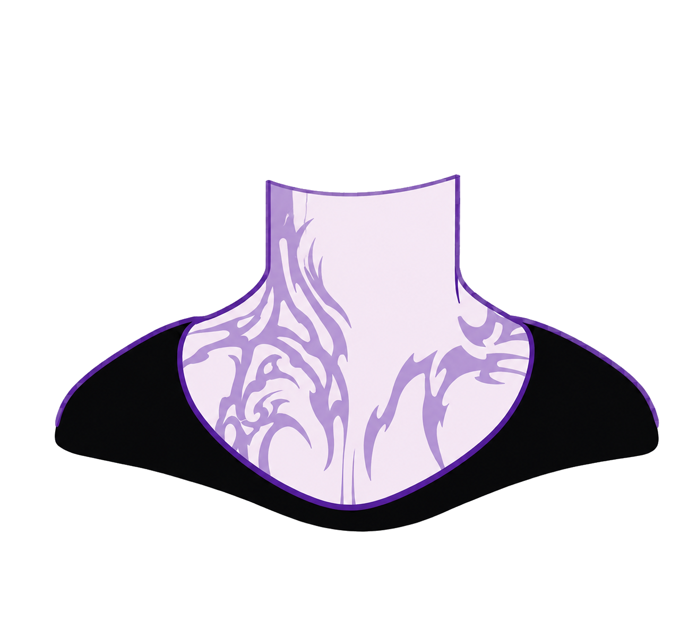
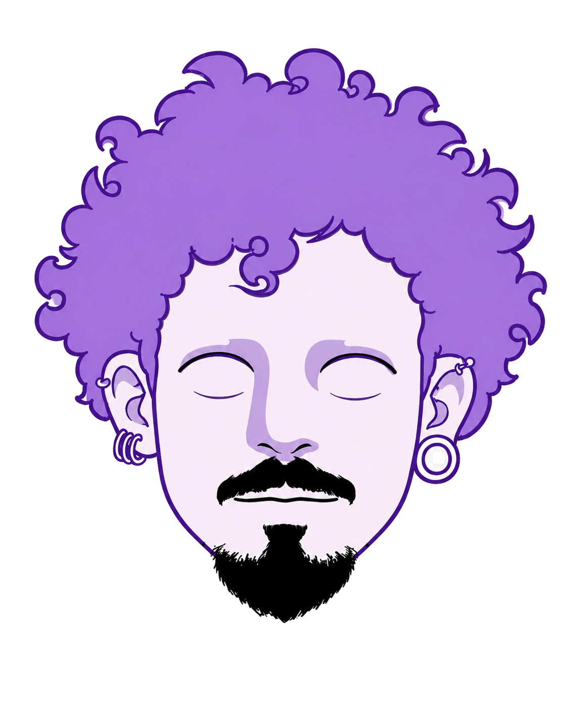

# Configuracao do avatar roxo

Arquivo criado para guardar os valores atuais da montagem do avatar em camadas.

## Imagens usadas

- `assets/images/tronco-avatar-roxo.png`
- `assets/images/rosto-avatar-roxo.png`
- `assets/images/sobrancelha-esquerda.png`
- `assets/images/sobrancelha-direita.png`

## Estrutura no HTML

```html
<div class="avatar-fundo" aria-hidden="true">
  
  <div class="avatar-rosto">
    
    <span class="olho-avatar olho-avatar-esquerdo">
      <span class="pupila-avatar"></span>
    </span>
    <span class="olho-avatar olho-avatar-direito">
      <span class="pupila-avatar"></span>
    </span>
    
    
  </div>
</div>
```

## Posicionamento principal

```css
.avatar-fundo {
  right: -18px;
  bottom: -24px;
  width: min(44vw, 470px);
  aspect-ratio: 1126 / 1397;
}

.avatar-tronco {
  left: 1.6%;
  top: 39.4%;
  width: 96.4%;
  opacity: 0.62;
}

.avatar-rosto {
  top: -2.9%;
  left: 3.6%;
  width: 92.5%;
  transform-origin: 50% 78%;
}

.imagem-rosto {
  opacity: 0.62;
}
```

## Olhos

```css
.olho-avatar {
  width: 7.4%;
  height: 5.2%;
}

.olho-avatar-esquerdo {
  left: 36.2%;
  top: 51%;
}

.olho-avatar-direito {
  left: 63%;
  top: 51%;
}

.pupila-avatar {
  width: 50%;
  height: 72%;
}
```

## Sobrancelhas

```css
.sobrancelha-avatar {
  opacity: 0.7;
}

.sobrancelha-avatar-esquerda {
  left: 42.1%;
  top: 35.9%;
  width: 18.3%;
  transform-origin: 82% 50%;
}

.sobrancelha-avatar-direita {
  left: 62.2%;
  top: 35.9%;
  width: 20.9%;
  transform-origin: 18% 50%;
}
```

## Movimento no JavaScript

```js
const movimentoX = Math.cos(angulo) * 2.4;
const movimentoY = Math.sin(angulo) * 1.8;

avatarRosto.style.setProperty("--mover-rosto-x", (lado * 5).toFixed(1) + "px");
avatarRosto.style.setProperty("--mover-rosto-y", (altura * 2).toFixed(1) + "px");
avatarRosto.style.setProperty("--girar-rosto", (lado * 2).toFixed(2) + "deg");
avatarRosto.style.setProperty("--girar-sobrancelha-esquerda", (-forcaEsquerda * 3 + altura).toFixed(2) + "deg");
avatarRosto.style.setProperty("--girar-sobrancelha-direita", (forcaDireita * 3 - altura).toFixed(2) + "deg");
avatarRosto.style.setProperty("--mover-sobrancelha-esquerda", (-forcaEsquerda + altura * 0.5).toFixed(1) + "px");
avatarRosto.style.setProperty("--mover-sobrancelha-direita", (-forcaDireita + altura * 0.5).toFixed(1) + "px");
```

## Observacao

O rosto atual esta mais proximo de uma versao com olhos fechados. Para ficar igual a referencia com olhos abertos, trocar `rosto-avatar-roxo.png` por uma versao com olhos abertos e manter a mesma estrutura.
